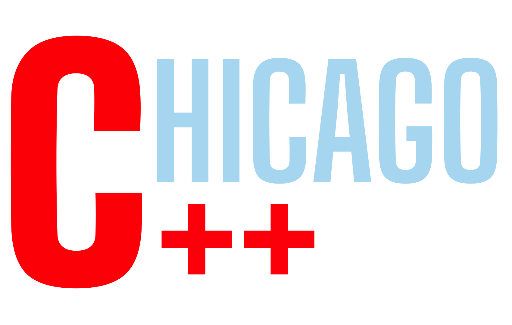

<link rel="apple-touch-icon" sizes="180x180" href="apple-touch-icon.png">
<link rel="icon" type="image/png" sizes="32x32" href="favicon-32x32.png">
<link rel="icon" type="image/png" sizes="16x16" href="favicon-16x16.png">
<link rel="manifest" href="site.webmanifest">
<link rel="mask-icon" href="safari-pinned-tab.svg" color="#5bbad5">
<meta name="msapplication-TileColor" content="#da532c">
<meta name="theme-color" content="#ffffff">

Welcome to the home of the Chicago C/C++ Users Group. We are dedicated to enriching and expanding the usage of C and C++ within the Chicago development community.

To see and register for upcoming events, please visit out [Meetup page](https://www.meetup.com/Chicago-C-CPP-Users-Group)

Check us out on [Twitter](https://twitter.com/ChicagoCppUsers)
<a href="https://twitter.com/ChicagoCppUsers?ref_src=twsrc%5Etfw" class="twitter-follow-button" data-show-count="false">Follow @ChicagoCppUsers</a>

Follow us on [LinkedIn](https://www.linkedin.com/company/chicago-cpp-users/about/)

