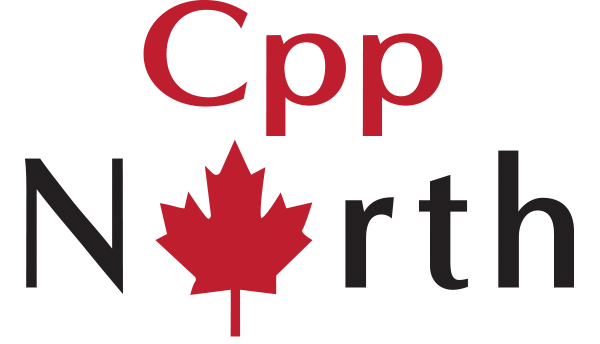

[back](README.md)

# Conferences

CppNorth is a production of CppToronto, a non-profit organization that aims to provide an 
open and collaborative place where software developers can meet and discuss C++.

CppOnline is an online-only C++ Conference bringing together people from across the globe to share and learn.
