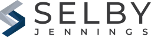
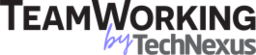

# C++'s Super Power

## Presenter: Matt Godbolt

We all know that C++ is a large and complex programming language. It’s become fashionable to publicize its shortcomings, but in this talk Matt wants to concentrate on the very best feature of C++ - its Superpower!
During this talk we’ll learn what C++’s Superpower is (which may surprise you!), after looking at some possible contenders. We’ll then explore the superpower through a hobby project of Matt’s, covering lots of both older and modern C++ concepts, and how one can migrate older code to new styles.
We’ll see how the Superpower has shaped C++ past, current and will continue to shape its future as a programming language, and why that’s really important in our day-to-day jobs as C++ developers.

## Event Details

Note: *Free Attendance, but reservation required* Please see RSVP through the group [Meetup page](https://www.meetup.com/Chicago-C-CPP-Users-Group/events/286101553)

When: June 13th, 2022  
Happy-hour start at 5:30, presentation at 6:30  
20 N Upper Wacker Drive  
12th Floor  
Chicago, IL 60606  

Food and beverages sponsored by Selby Jennings  

Conference space genereously provided by TeamWorking by TechNexus  

## About the Presenter

Matt is a C++ programmer and occasional verb. He loves writing efficient code and sharing his passion about how computers work under the hood. An engineer at Aquatic, he has previously worked on low-latency trading, on mobile apps at Google, run a C++ tools company and spent more than a decade making console games. When not tinkering on Compiler Explorer, Matt enjoys working on emulators for old 8-bit computer hardware.

