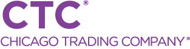

# Poor Man’s Introspection and Reflection in C++: Effective Pointer-to-Member Use

Pointer-to-member for data members and member functions are an underused construct in C++, 
but they can be employed to allow one to “visit” the members of a class in an organized 
fashion. They can provide some of the facilities that are available natively in other 
languages, namely a form of introspection (where a class instance can describe itself) 
and reflection (where a class instance can be mutated by means of its description). 
With some modern C++ techniques, this can be done in an minimally invasive way 
(you don’t have to alter the reflected class necessarily) with a reasonable syntax so 
that it looks as though it had been designed into the language intentionally. It is 
useful for creating, serializers and deserializers, automated testing, and more.

## Event Details

Note: *Free Attendance, but reservation required* 
Please see RSVP through the group [Meetup page](https://www.meetup.com/chicago-c-cpp-users-group/events/288020086/)

Also, action required for CovID protocol. Please see note, below.

When: Tuesday September 20th, 2022
Social-hour and food start at 5:30, presentation at 6:30

Chicago Trading Company
425 S. Financial
Chicago, IL

### Important Registration and CovID Protocol Notice!
Important Registration and CovID Protocol

Security and entrance procedures are a bit different from recent events. Guests will be 
checked in at the lobby of 425. To enter the building, you will need to RSVP both to 
this event and also fill out [CTC Guest Registration](https://www.c4wrk.com/ZDdXp8YcRR2JtRVL8) 
at least *48 hours* in advance of the 
presentation. This will ask for your name and for proof of CovID vaccination. You will 
need to check in at the lobby and show the link and Purple Pass you received from 
Cleared4, above. A CTC employee will be there to escort you to the presentation on the 
6th floor.

Conference space, food and beverages sponsored by Chicago Trading Company

## About the Presenter

Ron is a graduate of Harvard University Magna Cum Laude in Classics (Latin and Greek) 
with a Masters in Computer Science from Boston University. He has been programming 
since he got his first Atari 400 in the early 1980s. Ron has worked for Avid Technology, 
IBM, Apple, MorganStanley, Knight Capital, and is currently at Chicago Trading Company. 
His first job out of University was helping to port the Avid Media Composer to C++, and 
has been programming C++ ever since.

