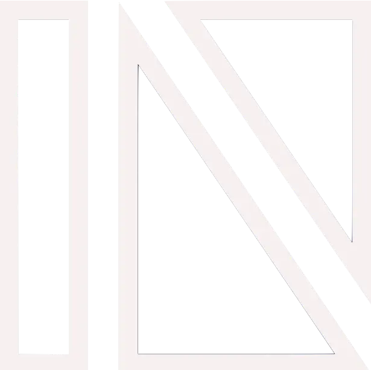

# Teaching an Old Dog New Tricks: A Tale of Two Emulators

## Presenter: Matt Godbolt

As a self-proclaimed C++ dinosaur, I set out to prove that my comfortable, battle-tested ways of writing code (somewhere between C++11 and C++14) were clearly superior to all this modern constexpr-everything, coroutine-laden C++. What better way to demonstrate this than by implementing the same ZX Spectrum emulator twice - once in familiar C++11 style, and once with all the shiny new features that folks these days seem to love?

Through practical examples and live demonstrations, we'll explore how modern C++ features transform - for better or worse - our approach to systems programming. Watch as my preconceptions about template metaprogramming, coroutines, and modules are challenged, and discover where modern features genuinely shine... and where they might just be showing off.

Whether you're another comfortable old dinosaur curious about modern C++, or a new grad wondering why some of us still write for loops instead of using std::ranges, you'll come away with concrete examples of how modern features apply to traditional problems. And perhaps, like me, you'll learn that teaching an old dog new tricks isn't always painful - sometimes it's just enlightening.

## Event Details

Note: *Free Attendance, but please RSVP!* 

Please see RSVP through the group [Meetup page](https://www.meetup.com/chicago-c-cpp-users-group/events/306645702)

When: Friday, March 14th
Happy-hour start at 5:00, presentation at 6:00
2145 Sheridan Rd
Room M152
Evanston, IL 60208

Food and beverages sponsored by Selby Jennings  

Conference space generously provided by Northwestern University and the NU Fintech

## About the Presenter

Matt is a C++ programmer and occasional verb. He loves writing efficient code and sharing his passion about how computers work under the hood. Gearing up for his next role in fintech, he has previously worked on low-latency trading, on mobile apps at Google, run a C++ tools company and spent more than a decade making console games. When not tinkering on Compiler Explorer, Matt enjoys working on emulators for old 8-bit computer hardware.

